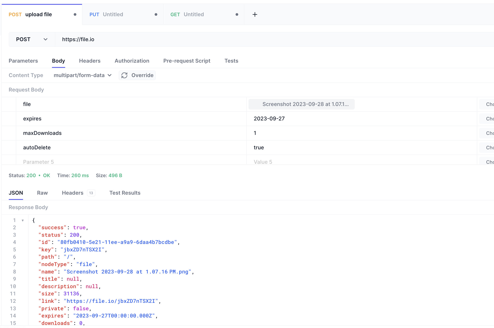
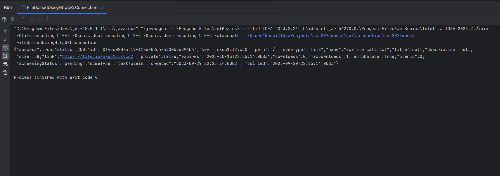

### Members
- Jaehyeon Park
- Makoto Takahara
- Tatsuya Shiokawa
- Kosei Uemura
- SHUHAN SUN
# Project Description
## Collaborative Task Management Platform
When working as a team, it is essential for all members to stay on track of the project by sharing their updates and organize meeting schedules with each other. 
For our project, we will be building a collaborative task management platform that can help the team to progress on their project and boost their productivity
Some of the features that we are considering are:
1. task creation / deletion / completion 
2. announcement for members 
3. calendar for scheduling and deadlines 
4. send notifications to email

# API Documentation
https://www.file.io/developers/
# Screenshot of using a tool to try out the API

This is an example of uploading a file on the server using file.io API.
# example output of running our Java code

This is the example output of running our java code. Here, we are uploading a file "example_call.txt".
# list of any technical problems blocking progress
- Configuration issue:
    - Initially, we were unaware that there was a need to modify the configuration settings to successfully run the main method in FileUploadUsingHttpURLConnection.java.
    - This took us about 30 minutes of debugging time to identify and resolve the issue, so that the code runs successfully now.
    - When we got an IOException error, we might want to have more information.
    - We might have network issues such as connectivity issues, timeouts, or server errors.
    - We also need to consider "OutOfMemoryError" especially for large files.
    - We also want to make sure to not make conflict when two or more people try update. 
    - We also had problems with merging, but it has been resolved.
    - (testing and practicing git merge from different branches)
